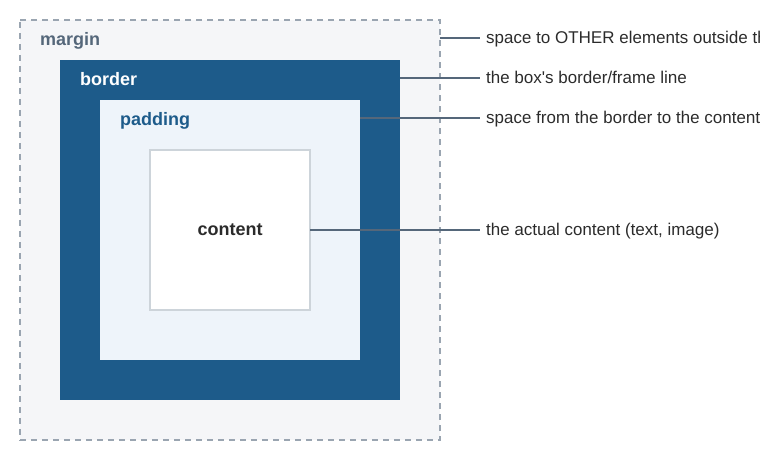

# 1. Basic Concepts of CSS

Before dissecting `style.css`, first get familiar with the CSS terms that
will keep appearing throughout this documentation.

## 1.1 What is CSS?

**CSS (Cascading Style Sheets)** is a language for controlling the
**appearance** of HTML elements — color, size, spacing, layout, and so
on. If HTML determines a page's **structure/content** (heading,
paragraph, table, form), CSS determines **what it looks like** on
screen.

## 1.2 Anatomy of a CSS Rule

```css
header {
    background-color: #1d5b8a;
    color: #fff;
}
```

| Part | Example | Function |
|---|---|---|
| **Selector** | `header` | Determines **which HTML element(s)** get this style. Here it means "every `<header>` tag". |
| **Declaration** | `background-color: #1d5b8a;` | One style rule, made up of a **property** and a **value**, ending with a semicolon `;`. |
| **Property** | `background-color` | The aspect of appearance being set (background color, font size, etc.). |
| **Value** | `#1d5b8a` | The value assigned to that property. |
| **Declaration block** | `{ ... }` | The curly braces that wrap one or more declarations for the same selector. |

## 1.3 Connecting CSS to HTML

There are 3 ways to connect CSS to HTML, but this jobsheet uses the
**most recommended** way: a separate CSS file, linked via a `<link>` tag
inside `<head>`:

```html
<link rel="stylesheet" href="assets/css/style.css">
```

- `rel="stylesheet"` — tells the browser that the linked file is a
  stylesheet.
- `href="..."` — the location of the CSS file. Just like the `<a href="...">`
  links in
  [the jobsheet-01 documentation](../../jobsheet-01/Documentation/01-basic-concepts.md#15-navigation-between-pages-a-href),
  this path is **relative** to the location of the HTML file — see the
  full explanation in [chapter 2](02-html-file-changes.md).

The benefit of separating CSS into its own file (compared to writing
styles directly on every HTML tag): **one `style.css` file is shared by
all 5 HTML pages at once** — if you want to change the button color, you
only need to change one line in `style.css`, and it automatically
updates on every page.

## 1.4 Types of Selectors Used in `style.css`

| Selector Type | Example in `style.css` | Meaning |
|---|---|---|
| **Tag/Element** | `body`, `header`, `table` | Selects every element with that tag. |
| **Universal** | `*` | Selects **all** elements without exception. |
| **Descendant** | `header nav ul`, `td button` | Selects a `ul` element that is **inside** a `nav` that is inside a `header`. Word order = nesting order in the HTML. |
| **Pseudo-class** | `a:hover`, `tbody tr:hover` | Selects an element in a certain **condition/state** — `:hover` means "while the mouse cursor is over this element". |
| **Positional pseudo-class** | `tbody tr:nth-child(even)`, `main section:nth-of-type(2)` | Selects an element based on its **order/position** among its siblings. Discussed in detail in [chapter 6](06-css-grid-stat-cards.md) and [chapter 7](07-css-table.md). |
| **Attribute** | `form button[type="submit"]` | Selects a `button` element whose `type` **attribute** has the value `"submit"`. |

## 1.5 The Box of Every HTML Element: Box Model

Every HTML element in the browser is actually a **box**, made up of 4
layers from the inside out:



- **`margin`** — empty space **outside** the box, toward neighboring elements.
- **`border`** — the line at the edge of the box.
- **`padding`** — empty space **inside** the box, between the border and the content.
- **`content`** — the actual content (text, images, etc.).

The `box-sizing: border-box;` property (used on the first line of
`style.css`, see [chapter 3](03-css-reset-and-body.md)) changes how an
element's width/height is calculated. This is an important concept
explained in detail in the next chapter.

## 1.6 Units of Measurement Used

In `style.css` you'll find several different units of measurement:

| Unit | Example | Meaning |
|---|---|---|
| `px` (pixel) | `border-radius: 8px;` | A **fixed/absolute** size, doesn't change based on anything. |
| `rem` | `padding: 1rem 1.5rem;` | A **relative** size based on the root font size (`<html>`), usually `1rem` = 16px by default. More flexible since it adjusts if the user changes the browser's font size. |
| `%` | `width: 100%;` | A size **relative** to its parent element (e.g. 100% of the width of its wrapping box). |
| `fr` (fraction) | `grid-template-columns: repeat(3, 1fr);` | A CSS Grid-specific unit: "1 fractional part" of the available space. Discussed in [chapter 6](06-css-grid-stat-cards.md). |

## 1.7 Colors in Hex Format

Colors in `style.css` are mostly written in **hex** (hexadecimal)
format, e.g. `#1d5b8a` or `#fff`:

- The `#RRGGBB` format — the first two digits for red, the next two for
  green, the last two for blue. `#1d5b8a` for example is dark blue (the
  blue component is the most dominant).
- `#fff` is the short form of `#ffffff` (full white) — if all three
  digit pairs are the same, you can write just 3 digits.

With the terms above under your belt, you're now ready to read the
detailed explanation of the `style.css` file starting from chapter 3.

Next: [What Changed in the HTML Files?](02-html-file-changes.md)
